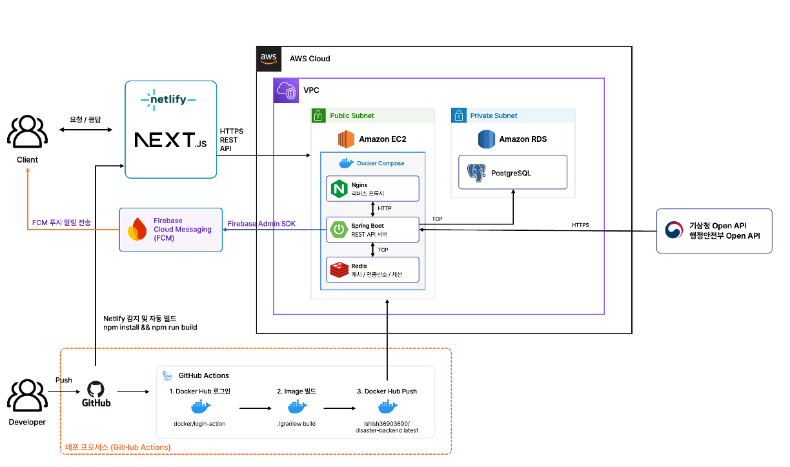

# Disaster Alert Archive

> 재난 안전 문자 아카이브 및 사용자 맞춤형 실시간 알림 서비스

[](https://nextjs.org/)
[](https://spring.io/projects/spring-boot)
[](https://www.postgresql.org/)
[](https://redis.io/)
[](https://www.docker.com/)

**🔗 배포 URL: [https://disaster-alert-archive.co.kr/](https://disaster-alert-archive.co.kr/)**

---

## 소개

행정안전부 공공 API로 수집한 재난 안전 문자를 아카이빙하고, 사용자가 설정한 관심 지역에 실시간 푸시 알림을 제공하는 서비스입니다.  
AI 기반 이벤트 클러스터링으로 중복 알림을 제거하고, 기상 데이터와 연계한 재난 통계 대시보드를 제공합니다.

---

## 주요 기능

| 기능 | 설명 |
|------|------|
| 재난 문자 아카이빙 | 행안부 Open API 수집 및 DB 저장, 검색/필터 제공 |
| 맞춤 푸시 알림 | 관심 지역 설정 → Firebase FCM 실시간 알림 (게스트 포함) |
| 이벤트 클러스터링 | 임베딩(text-embedding-3-small) + GPT-4o-mini로 중복 알림 병합 |
| 재난 통계 대시보드 | 지역별·유형별·기간별 통계 및 기상 상관 분석 시각화 |
| 위험도 분석 | 지역별 위험도 지수 산출 (유형 가중치 × 강도 × 시간 감쇠) 및 지도 표시 |
| 날씨 연계 | 기상청 관측 데이터 수집 및 재난 발령 시점 날씨 조회 |
| 다국어 지원 | DeepL API 기반 재난 문자 번역 (KO/EN/ZH/JA) |
| 소셜 로그인 | Google / Naver / Kakao OAuth2 |
| 재난 제보 / 댓글 | 재난 현장 제보 작성 및 재난 문자별 댓글 |
| 실종아동 | 실종아동 데이터 적재 및 조회 |
| 공개 OpenAPI | 토큰 기반 재난 문자 공개 API (JSON/CSV) |
| 지도 연동 | Kakao Map 기반 지역별 재난 현황 히트맵 시각화 |

---

## 기술 스택

### Frontend

| 분류 | 기술 |
|------|------|
| Framework | Next.js 15 (App Router) |
| 상태 관리 | Zustand |
| 서버 상태 | TanStack Query (React Query) |
| 폼 | React Hook Form + Zod |
| 스타일링 | TailwindCSS 4 |
| 차트 | Recharts |
| 알림 | Firebase SDK (FCM) + PWA (next-pwa) |
| 지도 | Kakao Map API |
| 배포 | Netlify |

### Backend

| 분류 | 기술 |
|------|------|
| Framework | Spring Boot 3.4.4 |
| ORM | JPA + QueryDSL + Spring Data JDBC |
| DB 마이그레이션 | Flyway |
| 인증/인가 | Spring Security + JWT + OAuth2 (Google·Naver·Kakao) |
| 캐시 | Redis |
| AI | Spring AI — GPT-4o-mini (이벤트 판정), text-embedding-3-small (클러스터링) |
| 번역 | DeepL API (KO/EN/ZH/JA) |
| 푸시 알림 | Firebase Admin SDK (FCM) |
| 모니터링 | Spring Actuator |
| API 문서 | SpringDoc OpenAPI (Swagger UI) |
| 배포 | AWS EC2 + Docker Compose + Nginx |

### 데이터

| 분류 | 기술 |
|------|------|
| 메인 DB | PostgreSQL + pgvector (VECTOR 1536) |
| 캐시 | Redis 7 |

### 외부 API

| API | 용도 |
|-----|------|
| 행정안전부 재난문자 API | 재난 안전 문자 수집 |
| 기상청 기상 API | 관측·요약 데이터 수집 |
| DeepL API | 재난 문자 다국어 번역 |
| Firebase Cloud Messaging | 웹 푸시 알림 |
| OpenAI GPT-4o-mini | 이벤트 요약 및 판정 |
| Kakao Maps API | 지도·히트맵·법정동 좌표 |
| OAuth (Google·Naver·Kakao) | 소셜 로그인 |

### Infrastructure

| 분류 | 기술 |
|------|------|
| 클라우드 | AWS EC2 |
| 컨테이너 | Docker + Docker Compose |
| 리버스 프록시 | Nginx |
| CI/CD | GitHub Actions |

---

## 시스템 아키텍처



---

## 프로젝트 구조

```
disaster-alert-archive/
├── backend/                  # Spring Boot REST API
│   └── src/main/java/…/
│       ├── domain/
│       │   ├── auth/         # JWT, OAuth2 소셜 로그인
│       │   ├── member/       # 회원, 관심 지역
│       │   ├── disasteralert/# 재난 문자 수집·조회·통계
│       │   ├── event/        # 이벤트 클러스터링 (AI)
│       │   ├── risk/         # 위험도 분석
│       │   ├── weather/      # 기상 데이터
│       │   ├── notification/ # FCM 알림
│       │   ├── community/    # 재난 제보·댓글
│       │   ├── missingperson/# 실종아동 데이터
│       │   ├── openapi/      # 공개 OpenAPI
│       │   └── legaldistrict/# 법정동 코드
│       ├── global/           # 보안·예외·공통 응답 포맷 등 공통 설정
│       ├── scheduler/        # 재난 문자 수집 스케줄러
│       └── api/              # 외부 Open API 클라이언트
└── frontend/                 # Next.js (App Router)
    └── src/
        ├── app/               # 라우트별 페이지
        ├── components/        # 공통·도메인 컴포넌트
        ├── store/             # Zustand 스토어
        ├── hooks/             # 커스텀 훅
        ├── lib/queries, mutations/  # React Query 훅
        └── api/               # axios 기반 API 클라이언트
```

---

## 로컬 개발 환경 설정

### 사전 요구사항

- Java 17+
- Node.js 20+
- Docker + Docker Compose

### 백엔드

```bash
# Docker로 PostgreSQL(pgvector) + Redis 실행 (레포 루트에서)
docker compose -f docker-compose.dev.yml up postgres redis

# 환경 변수는 루트 .env.dev 값을 참고해 로컬 환경(또는 IDE 실행 설정)에 채운다

cd backend
./gradlew bootRun
```

### 프론트엔드

```bash
cd frontend

# 패키지 설치
npm install

# 환경 변수 설정 (frontend/.env.local 참고)

# 개발 서버 실행 (http://localhost:3000)
npm run dev
```

---

## 환경 변수

주요 환경 변수 목록입니다. 전체 목록은 루트 `.env.dev`를 참고하세요.

| 변수 | 설명 |
|------|------|
| `POSTGRES_DB` / `POSTGRES_USER` / `POSTGRES_PASSWORD` | PostgreSQL 접속 정보 |
| `REDIS_HOST` / `REDIS_PORT` | Redis 접속 정보 |
| `JWT_SECRET` | JWT 서명 키 |
| `DISASTER_ALERT_SERVICE_KEY` | 행안부 Open API 키 |
| `KMA_ASOS_API_KEY` | 기상청 Open API 키 |
| `OPENAI_API_KEY` | OpenAI 호환 AI API 키 |
| `DEEPL_API_KEY` | DeepL 번역 API 키 |
| `GOOGLE_OAUTH_CLIENT_ID` / `_SECRET` | Google OAuth2 |
| `KAKAO_OAUTH_CLIENT_ID` / `_SECRET` | Kakao OAuth2 |
| `NAVER_OAUTH_CLIENT_ID` / `_SECRET` | Naver OAuth2 |

---

## API 문서

로컬 실행 후 아래 URL에서 Swagger UI를 확인할 수 있습니다.

```
http://localhost:8080/swagger-ui.html
```
