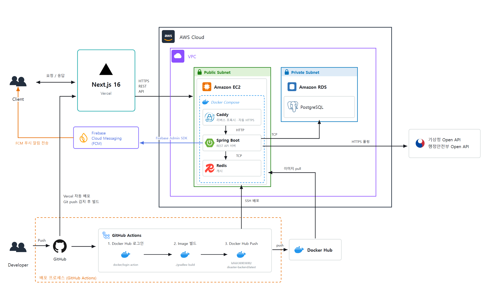

# Disaster Alert Archive

> 재난 안전 문자 아카이브 및 사용자 맞춤형 실시간 알림 서비스

[](https://nextjs.org/)
[](https://spring.io/projects/spring-boot)
[](https://www.postgresql.org/)
[](https://redis.io/)
[](https://www.docker.com/)

**🔗 배포 URL: [https://disaster-alert-archive.co.kr/](https://disaster-alert-archive.co.kr/)**

---

## 소개

행정안전부 공공 API로 수집한 재난 안전 문자를 아카이빙하고, 사용자가 설정한 관심 지역에 실시간 푸시 알림을 제공하는 서비스입니다.  
AI 기반 이벤트 클러스터링으로 중복 알림을 제거하고, 기상 데이터와 연계한 재난 통계 대시보드를 제공합니다.

---

## 주요 기능

| 기능 | 설명 |
|------|------|
| 재난 문자 아카이빙 | 행안부 Open API 수집 및 DB 저장, 검색/필터 제공 |
| 맞춤 푸시 알림 | 관심 지역 설정 → Firebase FCM 실시간 알림 (게스트 포함) |
| 이벤트 클러스터링 | 임베딩(text-embedding-3-small) + GPT-4o-mini로 중복 알림 병합 |
| 재난 통계 대시보드 | 지역별·유형별·기간별 통계 및 기상 상관 분석 시각화 |
| 위험도 분석 | 지역별 위험도 지수 산출 (유형 가중치 × 강도 × 시간 감쇠) 및 지도 표시 |
| 날씨 연계 | 기상청 관측 데이터 수집 및 재난 발령 시점 날씨 조회 |
| 다국어 지원 | OpenAI 기반 재난 문자·이벤트 제목 번역 (원본 KO → EN/JA/ZH/VI/TH). 법정동 명칭은 별도 시드 테이블 조회(EN/JA/ZH) |
| 소셜 로그인 | Google / Naver / Kakao OAuth2 |
| 재난 제보 / 커뮤니티 | 사용자 재난 제보 알림 작성, 커뮤니티 게시판(공지·자유), 재난 문자·제보별 댓글 |
| 실종자 알림 병합 | 실종자 관련 재난 문자를 동일 인물 기준으로 판정해 지역을 넘어 하나의 이벤트로 병합 |
| 공개 OpenAPI | 토큰 기반 재난 문자 공개 API (JSON/CSV) |
| 지도 연동 | Kakao Map 기반 지역별 재난 현황 히트맵 시각화 |

---

## 기술 스택

### Frontend

| 분류 | 기술 |
|------|------|
| Framework | Next.js 16 (App Router) |
| 상태 관리 | Zustand |
| 서버 상태 | TanStack Query (React Query) |
| 폼 | React Hook Form + Zod |
| 스타일링 | TailwindCSS 4 |
| 차트 | Recharts |
| 다국어 | i18next + react-i18next (KO/EN/JA/ZH/VI/TH) |
| 알림 | Firebase SDK (FCM) + PWA (`@ducanh2912/next-pwa`) |
| 지도 | Kakao Map API |
| 테스트 | Jest (`npm test`), Playwright 스크린샷 스크립트 (`scripts/`) |
| 배포 | Vercel |

### Backend

| 분류 | 기술 |
|------|------|
| Framework | Spring Boot 3.4.4 |
| ORM | JPA + QueryDSL + Spring Data JDBC |
| DB 마이그레이션 | Flyway |
| 인증/인가 | Spring Security + JWT + OAuth2 (Google·Naver·Kakao) |
| 캐시 | Redis |
| AI | Spring AI 1.0.0 — `gpt-4o-mini` (이벤트/위험도 판정), `text-embedding-3-small` 1536차원 (클러스터링) |
| 번역 | OpenAI `gpt-4o` (KO → EN/JA/ZH/VI/TH) — 지명 음차 품질 때문에 번역만 상위 모델을 per-call 오버라이드 |
| 푸시 알림 | Firebase Admin SDK (FCM) |
| 로깅 | LogTrace 스타일 AOP 호출 추적 (`global/logtrace`) |
| 모니터링 | Spring Actuator + Sentry (`sentry-spring-boot-starter-jakarta` + `sentry-logback`) |
| API 문서 | SpringDoc OpenAPI (Swagger UI) |
| 배포 | AWS EC2 + Docker Compose + Caddy, GHCR 이미지 |

### 데이터

| 분류 | 기술 |
|------|------|
| 메인 DB | PostgreSQL + pgvector (VECTOR 1536) — 로컬은 `pgvector/pgvector:pg15`, 운영은 AWS RDS |
| 캐시 | Redis 7 |
| 마이그레이션 | Flyway (`backend/src/main/resources/db/migration`, `ddl-auto: validate`) |

### 외부 API

| API | 용도 |
|-----|------|
| 행정안전부 재난문자 API | 재난 안전 문자 수집 |
| 기상청 기상 API | 관측·요약 데이터 수집 |
| OpenAI API | 임베딩(이벤트 클러스터링), LLM 판정(이벤트 병합·cross-region·위험도 프로파일), 재난 문자 다국어 번역 |
| Firebase Cloud Messaging | 웹 푸시 알림 |
| Kakao Maps API | 지도·히트맵·법정동 좌표 |
| OAuth (Google·Naver·Kakao) | 소셜 로그인 |

### Infrastructure

| 분류 | 기술 |
|------|------|
| 클라우드 | AWS EC2 (백엔드), AWS RDS (PostgreSQL) |
| 컨테이너 | Docker + Docker Compose |
| 리버스 프록시 | Caddy (자동 HTTPS) |
| CI/CD | GitHub Actions |

---

## 시스템 아키텍처



---

## 프로젝트 구조

```
disaster-alert-archive/
├── backend/                  # Spring Boot REST API (모든 엔드포인트는 /api/v1/*)
│   └── src/main/java/…/
│       ├── domain/
│       │   ├── auth/         # JWT, OAuth2 소셜 로그인 (자체 구현)
│       │   ├── member/       # 회원, 관심 지역
│       │   ├── disasteralert/# 재난 문자 수집·조회·통계
│       │   ├── event/        # 이벤트 클러스터링 (AI)
│       │   ├── risk/         # 위험도 분석·감쇠·인접 지역 확산
│       │   ├── weather/      # 기상 데이터 수집·일별 집계
│       │   ├── notification/ # FCM 알림
│       │   ├── community/    # 커뮤니티 게시판 (공지·자유)
│       │   ├── comment/      # 재난 문자·사용자 제보에 달리는 댓글
│       │   ├── useralert/    # 사용자가 직접 작성하는 재난 제보 알림
│       │   ├── openapi/      # 공개 OpenAPI (토큰·JSON/CSV)
│       │   ├── legaldistrict/# 법정동 코드
│       │   └── common/       # 도메인 공통 예외
│       ├── global/           # 보안·예외·공통 응답 포맷·번역·LogTrace 등 공통 관심사
│       ├── scheduler/        # 재난 문자 수집 스케줄러
│       └── api/              # 외부 Open API 클라이언트
├── frontend/                 # Next.js (App Router)
│   └── src/
│       ├── app/               # 라우트별 페이지
│       ├── components/        # 공통·도메인 컴포넌트
│       ├── store/             # Zustand 스토어
│       ├── hooks/             # 커스텀 훅
│       ├── lib/queries, mutations/  # React Query 훅
│       ├── constants/         # i18n 리소스 등 상수
│       ├── ui/                # 재난 유형·등급·시도 표시용 매핑 테이블
│       └── api/               # axios 기반 API 클라이언트
├── specs/                    # 서브시스템별 as-built 명세 (spec.md / plan.md)
└── docs/                     # PRD·TRD·API/데이터 모델 문서, 시스템 구성도
```

> 실종자 전용 백엔드 도메인은 없다. 실종자는 재난 문자에서 파생되는 개념이라
> `domain/event`의 동일 인물 판정(`MissingPersonIdentity`)과 `domain/disasteralert` 조회 필터로 구현되어 있다.

---

## 로컬 개발 환경 설정

### 사전 요구사항

- Java 17+
- Node.js 20+
- Docker + Docker Compose

### 백엔드

```bash
# Docker로 PostgreSQL(pgvector) + Redis 실행 (레포 루트에서, --profile docker 불필요)
docker compose -f docker-compose.dev.yml up postgres redis

# 레포 루트의 .env.example을 .env.dev로 복사해 값을 채운다
cp .env.example .env.dev

cd backend
./gradlew bootRun
```

> 백엔드/프론트엔드는 `docker-compose.dev.yml`의 `docker` 프로필에도 정의돼 있지만, 로컬 개발 시에는 Postgres/Redis만 컨테이너로 띄우고 백엔드·프론트엔드는 위처럼 직접 실행하는 것을 권장한다.

### 프론트엔드

```bash
cd frontend

# 패키지 설치
npm install

# 환경 변수 설정
cp .env.local.example .env.local   # 값을 채운다

# 개발 서버 실행 (http://localhost:3000, Turbopack)
npm run dev
```

---

## 환경 변수

주요 환경 변수 목록입니다. 전체 목록/템플릿은 루트 `.env.example`(백엔드)과 `frontend/.env.local.example`(프론트엔드)를 참고하세요.

| 변수 | 설명 |
|------|------|
| `POSTGRES_DB` / `POSTGRES_USER` / `POSTGRES_PASSWORD` | PostgreSQL 접속 정보 |
| `REDIS_HOST` / `REDIS_PORT` | Redis 접속 정보 |
| `JWT_SECRET` | JWT 서명 키 |
| `DISASTER_ALERT_SERVICE_KEY` | 행안부 Open API 키 |
| `KMA_ASOS_API_KEY` | 기상청 Open API 키 |
| `OPENAI_API_KEY` | Spring AI — 임베딩·LLM 판정·번역 공용 키 |
| `TRANSLATION_ENABLED` | 번역 기능 on/off (미설정 시 `true`). 번역 엔진은 OpenAI 이며 `OPENAI_API_KEY` 를 임베딩·LLM 판정과 공유하므로 번역 전용 키가 없다 |
| `CLUSTERING_ENABLED` / `LLM_FALLBACK_ENABLED` / `CROSS_REGION_ENABLED` | 이벤트 클러스터링 기능 플래그 (모두 기본값 `false`) |
| `GOOGLE_OAUTH_CLIENT_ID` / `_SECRET` | Google OAuth2 |
| `KAKAO_OAUTH_CLIENT_ID` / `_SECRET` | Kakao OAuth2 |
| `NAVER_OAUTH_CLIENT_ID` / `_SECRET` | Naver OAuth2 |
| `GMAIL_USERNAME` / `GMAIL_PASSWORD` | 메일 발송(SMTP) 계정 |
| `SENTRY_DSN` / `SENTRY_ENVIRONMENT` | Sentry 에러 트래킹 (DSN 을 비워두면 SDK가 자동 no-op) |

> FCM 발송용 서비스 계정 키는 환경변수가 아니라 클래스패스 파일로 읽는다 —
> `backend/src/main/resources/firebase-service-account.json` 에 두어야 알림 발송이 동작한다.

---

## API 문서

로컬 실행 후 아래 URL에서 Swagger UI를 확인할 수 있습니다. 모든 엔드포인트는 `/api/v1/*` 아래에 있습니다.

```
http://localhost:8080/swagger-ui.html
```

---

## 테스트

```bash
cd backend  && ./gradlew test    # realApi 태그 제외 전체 테스트
cd frontend && npm test          # Jest
```

`@Tag("realApi")` 가 붙은 테스트는 실제 OpenAI API를 호출해 요금이 발생하고 응답이 결정적이지 않으므로
기본 `test` 태스크에서 제외돼 있다. 필요할 때만 `./gradlew realApiTest` 로 따로 실행한다.

DB에 붙는 통합 테스트는 `@IntegrationTest`(= `@SpringBootTest` + `test` 프로파일 + `backend/.env.test` 로딩)를
사용하므로, dev docker-compose와 동일한 구성의 Postgres에 접속 가능해야 한다.

---

## 문서

| 문서 | 내용 |
|------|------|
| [`specs/001-event-clustering-pipeline/`](specs/001-event-clustering-pipeline/) | 이벤트 클러스터링 파이프라인 as-built 명세 |
| [`specs/002-risk-scoring/`](specs/002-risk-scoring/) | 지역 위험도 계산·감쇠·확산 |
| [`specs/003-fcm-notification/`](specs/003-fcm-notification/) | FCM 푸시 알림 |
| [`specs/004-legal-district-matching/`](specs/004-legal-district-matching/) | 법정동 코드 기반 지역 매칭 |
| [`specs/005-translation-pipeline/`](specs/005-translation-pipeline/) | 다국어 번역 파이프라인 |
| [`docs/`](docs/) | PRD·TRD·API 명세·데이터 모델·테스트 케이스 |
| [`CLAUDE.md`](CLAUDE.md) | 저장소 작업 가이드(아키텍처 요약·팀 컨벤션·함정) |

---

## 라이선스

[MIT](LICENSE)
